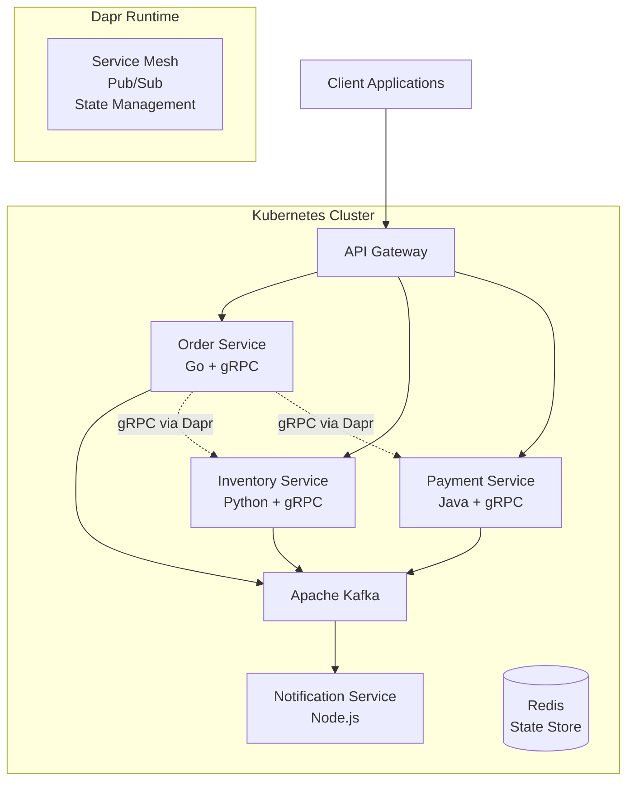

# Event-Driven Microservices Demo

A comprehensive demonstration of event-driven microservices architecture using modern cloud-native technologies.

## 🏗️ Architecture Overview

This demo showcases a realistic e-commerce order processing system built with:

- **🔄 Event Streaming**: Apache Kafka for asynchronous communication
- **⚡ Service Communication**: gRPC for high-performance synchronous calls  
- **🚀 Application Runtime**: Dapr for service mesh capabilities
- **☸️ Orchestration**: Kubernetes for deployment and service discovery
- **🐳 Containerization**: Docker for consistent environments

## 🎯 Business Scenario

The demo simulates an e-commerce order processing workflow:

1. **Order Creation** → Customer places an order
2. **Inventory Check** → System validates product availability  
3. **Payment Processing** → Payment is processed and verified
4. **Notifications** → Customer and staff receive updates
5. **Order Fulfillment** → Order status updates throughout the process

## 🏛️ Service Architecture



## 🛠️ Technology Stack

| Component | Technology | Purpose |
|-----------|------------|---------|
| **Order Service** | Go + gRPC | Order management and orchestration |
| **Inventory Service** | Python + gRPC | Product inventory management |
| **Payment Service** | Java + gRPC | Payment processing |
| **Notification Service** | Node.js | Event-driven notifications |
| **API Gateway** | Go + REST | External API aggregation |
| **Message Broker** | Apache Kafka | Event streaming |
| **State Store** | Redis | Distributed state management |
| **Service Mesh** | Dapr | Service discovery, pub/sub, state |
| **Orchestration** | Kubernetes | Container orchestration |

## 🚀 Quick Start

### Prerequisites

- Docker & Docker Compose
- Kubernetes cluster (local or cloud)
- Dapr CLI
- kubectl

### Local Development

```bash
# Clone the repository
git clone https://github.com/sumit760/event-driven-services-demo.git
cd event-driven-services-demo

# Start the entire stack locally
./scripts/deploy-local.sh

# Test the system
python examples/client/order-client.py
```

### Kubernetes Deployment

```bash
# Deploy to Kubernetes
./scripts/deploy-k8s.sh

# Check deployment status
kubectl get pods -n demo

# Access the API Gateway
kubectl port-forward svc/api-gateway 8080:80 -n demo
```

## 📚 Documentation

- [📖 Architecture Deep Dive](docs/architecture.md)
- [🔧 Setup & Installation](docs/setup.md)
- [🔌 API Documentation](docs/api.md)
- [📊 Event Schemas](docs/events.md)
- [🐛 Troubleshooting](docs/troubleshooting.md)

## 🧪 Testing

```bash
# Run integration tests
python -m pytest tests/integration/

# Load testing
./scripts/load-test.sh

# Monitor system health
./scripts/health-check.sh
```

## 📈 Observability

The demo includes comprehensive observability:

- **Metrics**: Prometheus + Grafana dashboards
- **Tracing**: Jaeger distributed tracing
- **Logging**: Structured logging with correlation IDs
- **Health Checks**: Kubernetes liveness/readiness probes

## 🎓 Learning Objectives

This demo teaches:

1. **Event-Driven Architecture** patterns and best practices
2. **Microservices Communication** via gRPC and events
3. **Dapr Integration** for cloud-native applications
4. **Kubernetes Deployment** strategies
5. **Observability** in distributed systems
6. **Testing Strategies** for microservices

## 🤝 Contributing

1. Fork the repository
2. Create a feature branch
3. Make your changes
4. Add tests
5. Submit a pull request

## 📄 License

This project is licensed under the MIT License - see the [LICENSE](LICENSE) file for details.

## 🙏 Acknowledgments

- [Dapr](https://dapr.io/) for the excellent service mesh runtime
- [Apache Kafka](https://kafka.apache.org/) for reliable event streaming
- [gRPC](https://grpc.io/) for efficient service communication
- [Kubernetes](https://kubernetes.io/) for container orchestration

