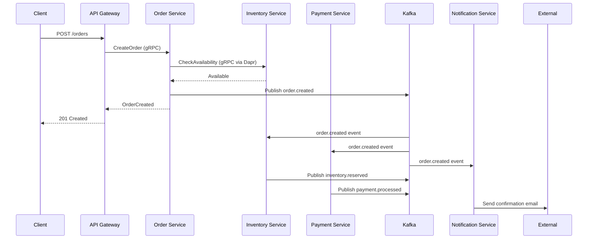
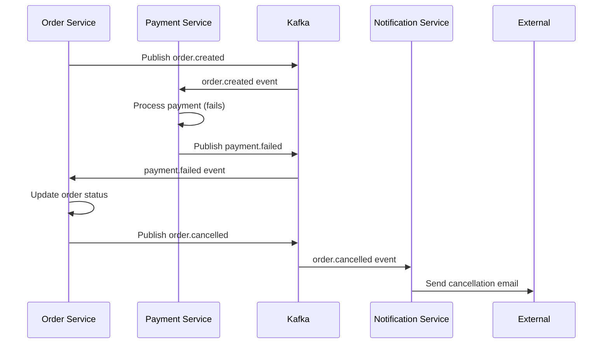

# Architecture Deep Dive

## Overview

This document provides a detailed explanation of the event-driven microservices architecture implemented in this demo.

## Core Principles

### 1. Event-Driven Architecture (EDA)
- **Loose Coupling**: Services communicate through events, reducing direct dependencies
- **Scalability**: Services can scale independently based on their specific load patterns
- **Resilience**: System continues to function even if individual services are temporarily unavailable
- **Auditability**: All state changes are captured as events, providing a complete audit trail

### 2. Domain-Driven Design (DDD)
- **Bounded Contexts**: Each service owns its domain and data
- **Ubiquitous Language**: Consistent terminology across service boundaries
- **Aggregate Roots**: Clear ownership of data consistency boundaries

## Service Architecture

### Order Service (Go)
**Responsibilities:**
- Order lifecycle management
- Order validation and business rules
- Orchestrating order processing workflow

**Communication Patterns:**
- **Inbound**: gRPC APIs for order operations
- **Outbound**: Publishes order events to Kafka
- **Synchronous**: Calls inventory and payment services via Dapr

**Key Events Published:**
- `order.created`
- `order.updated` 
- `order.cancelled`
- `order.completed`

### Inventory Service (Python)
**Responsibilities:**
- Product inventory management
- Stock level tracking
- Inventory reservations

**Communication Patterns:**
- **Inbound**: gRPC APIs for inventory queries, Kafka events for order processing
- **Outbound**: Publishes inventory events to Kafka
- **State**: Uses Dapr state store for inventory data

**Key Events:**
- **Consumes**: `order.created`, `order.cancelled`
- **Publishes**: `inventory.reserved`, `inventory.released`, `inventory.updated`

### Payment Service (Java)
**Responsibilities:**
- Payment processing
- Payment method validation
- Transaction management

**Communication Patterns:**
- **Inbound**: gRPC APIs for payment operations, Kafka events for order processing
- **Outbound**: Publishes payment events to Kafka
- **External**: Integrates with payment gateways (simulated)

**Key Events:**
- **Consumes**: `order.created`, `inventory.reserved`
- **Publishes**: `payment.processed`, `payment.failed`, `payment.refunded`

### Notification Service (Node.js)
**Responsibilities:**
- Multi-channel notifications (email, SMS, push)
- Notification templates and personalization
- Delivery tracking and retry logic

**Communication Patterns:**
- **Inbound**: Kafka events from all services
- **Outbound**: External notification providers (simulated)
- **Pure Event Consumer**: No gRPC APIs exposed

**Key Events Consumed:**
- `order.*` - Order status notifications
- `payment.*` - Payment confirmations
- `inventory.*` - Stock alerts

### API Gateway (Go)
**Responsibilities:**
- External API aggregation
- Request routing and load balancing
- Authentication and rate limiting
- Response transformation

**Communication Patterns:**
- **Inbound**: REST APIs from clients
- **Outbound**: gRPC calls to backend services via Dapr
- **Aggregation**: Combines multiple service calls into single responses

## Technology Integration

### Dapr Integration

#### Service Invocation
```yaml
# Service-to-service calls via Dapr
POST http://localhost:3500/v1.0/invoke/inventory-service/method/check-availability
```

#### Pub/Sub
```yaml
# Publishing events
POST http://localhost:3500/v1.0/publish/kafka-pubsub/order.created
```

#### State Management
```yaml
# Storing state
POST http://localhost:3500/v1.0/state/redis-statestore
```

### Kafka Topics

| Topic | Producers | Consumers | Schema |
|-------|-----------|-----------|---------|
| `order.created` | Order Service | Inventory, Payment, Notification | OrderCreatedEvent |
| `order.updated` | Order Service | Notification | OrderUpdatedEvent |
| `inventory.reserved` | Inventory Service | Payment, Notification | InventoryReservedEvent |
| `payment.processed` | Payment Service | Order, Notification | PaymentProcessedEvent |

### gRPC Service Definitions

#### Order Service
```protobuf
service OrderService {
  rpc CreateOrder(CreateOrderRequest) returns (CreateOrderResponse);
  rpc GetOrder(GetOrderRequest) returns (GetOrderResponse);
  rpc UpdateOrder(UpdateOrderRequest) returns (UpdateOrderResponse);
  rpc CancelOrder(CancelOrderRequest) returns (CancelOrderResponse);
}
```

#### Inventory Service
```protobuf
service InventoryService {
  rpc CheckAvailability(CheckAvailabilityRequest) returns (CheckAvailabilityResponse);
  rpc ReserveInventory(ReserveInventoryRequest) returns (ReserveInventoryResponse);
  rpc ReleaseInventory(ReleaseInventoryRequest) returns (ReleaseInventoryResponse);
}
```

## Data Flow Patterns

### 1. Order Creation Flow


### 2. Error Handling Flow


## Deployment Architecture

### Kubernetes Resources

#### Service Mesh
- **Dapr Sidecars**: Injected into each service pod
- **Service Discovery**: Kubernetes DNS + Dapr service invocation
- **Load Balancing**: Kubernetes services + Dapr

#### Networking
- **Ingress**: NGINX ingress controller for external access
- **Service Mesh**: Dapr handles inter-service communication
- **Network Policies**: Restrict traffic between services

#### Storage
- **Kafka**: Persistent volumes for message durability
- **Redis**: In-memory state store with persistence
- **Databases**: Each service can have its own database

### Observability Stack

#### Metrics
- **Prometheus**: Metrics collection from services and Dapr
- **Grafana**: Dashboards for system monitoring
- **Custom Metrics**: Business metrics (orders/sec, payment success rate)

#### Tracing
- **Jaeger**: Distributed tracing across services
- **Dapr Integration**: Automatic trace propagation
- **Custom Spans**: Business operation tracing

#### Logging
- **Structured Logging**: JSON format with correlation IDs
- **Log Aggregation**: ELK stack or similar
- **Error Tracking**: Centralized error monitoring

## Security Considerations

### Authentication & Authorization
- **mTLS**: Service-to-service encryption via Dapr
- **JWT Tokens**: Client authentication at API Gateway
- **RBAC**: Kubernetes role-based access control

### Data Protection
- **Encryption**: Data at rest and in transit
- **Secrets Management**: Kubernetes secrets + external secret stores
- **Network Segmentation**: Network policies and service mesh

### Event Security
- **Event Signing**: Cryptographic signatures for critical events
- **Schema Validation**: Enforce event schema compliance
- **Audit Logging**: Complete audit trail of all events

## Scalability Patterns

### Horizontal Scaling
- **Stateless Services**: All services designed to be stateless
- **Event Partitioning**: Kafka partitions for parallel processing
- **Database Sharding**: Partition data across multiple databases

### Performance Optimization
- **Connection Pooling**: gRPC connection reuse
- **Caching**: Redis for frequently accessed data
- **Batch Processing**: Bulk event processing where appropriate

### Resource Management
- **Resource Limits**: CPU and memory limits for all containers
- **Auto-scaling**: HPA based on CPU, memory, and custom metrics
- **Quality of Service**: Different QoS classes for different services

## Testing Strategy

### Unit Testing
- **Service Logic**: Business logic testing
- **Event Handlers**: Event processing logic
- **gRPC Handlers**: API endpoint testing

### Integration Testing
- **Service Interactions**: Test service-to-service communication
- **Event Flows**: End-to-end event processing
- **Database Integration**: Data persistence testing

### End-to-End Testing
- **User Journeys**: Complete business workflows
- **Performance Testing**: Load and stress testing
- **Chaos Engineering**: Failure scenario testing

## Future Enhancements

### Advanced Patterns
- **Event Sourcing**: Store all state changes as events
- **CQRS**: Separate read and write models
- **Saga Pattern**: Distributed transaction management

### Additional Services
- **User Service**: User management and authentication
- **Analytics Service**: Real-time analytics and reporting
- **Recommendation Service**: ML-based product recommendations

### Infrastructure
- **Multi-Region**: Deploy across multiple regions
- **Service Mesh**: Istio or Linkerd for advanced traffic management
- **GitOps**: Automated deployment with ArgoCD or Flux or ArgoRollout for Canary deployment
- **Continuous Promotion**: Continuous promotion worflow across environments using Kargo.io

